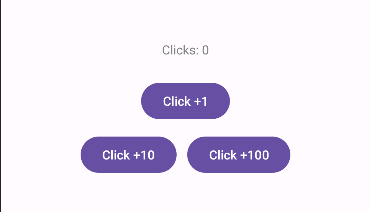

Язык : [us](./README.md) | ru
 
# Clicker
На этот раз я сделал простой "кликер". В этой программе есть 3 кнопки - добавить 1 клик, 10 или 100. Я, наконец, начал использовать Java для обработки событий

 ## Совместимость
 
Это уже стандартно, программа создана на "AndroidStudio` и несовместима с Apple

| </br>Android | </br>Apple |
:-------:|:-------:|
|    ✔️  |    ❌  |
 

 


<h1 align="center">Важные моменты кода</h1> 

На этот раз в коде присутствует "Java". В Java у меня есть 3 функции: OnClick 1, OnClick 2 и OnClick 3, каждая из этих функций добавляет клики, просто в разном количестве
### Пример

```
public void OnClick1(View v) {
        click ++;
        textView.setText("Clicks: " + click);
    }
```
Все остальные функции работают по тому же принципу

Я также использовал `Margin` в XML-дизайне. Это отступы от кнопок и текста

```
android:layout_marginTop="20pt"
android:layout_marginBottom="5pt"
```
Я также использовал `RelativeLayout внутри другого RelativeLayout` вместо одного LinearLayout, чтобы расположить кнопки горизонтально
```
<RelativeLayout
    xmlns:android="http://schemas.android.com/apk/res/android"
    xmlns:tools="http://schemas.android.com/tools"
    android:layout_width="match_parent"
    android:layout_height="match_parent"
    tools:context=".MainActivity">
    ...
    <RelativeLayout
        android:layout_width="wrap_content"
        android:layout_height="wrap_content"
        android:layout_below="@+id/button1"
        android:layout_centerHorizontal="true">
    ...
    </RelativeLayout>
</RelativeLayout>

```

<div align="center">

# Изображение

  
